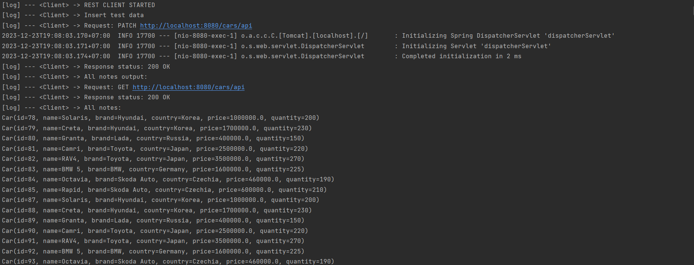

Борисюк Кирилл Алексеевич КИ21-16/2б
РКИС Лабораторная работа №8
Вариант-3


Инструкция запуска из консоли.

Скачайте проект или выполните команду:
```
git clone https://github.com/Querang/RKIS8.git
```

В консоли перейти в папку с проектом, после:
1) Запустить ActiveMQ:
```
activemq start
```
2) Создание базы данных:
```
psql -U postgres -h localhost -f car_db.sql  
```
3) Собрать проект при помощи команды:
```
.\mvnw.cmd package
```
4) Запустить программу:
```
java -jar target/RKIS8-0.0.1-SNAPSHOT.jar 
```
5) Открывать [страницу localhost](http://127.0.0.1:8080)

Для сборки необходим Maven - https://maven.apache.org/download.cgi


### Вариант 3: Автомобиль

Функционал из работы №7

Отправка сообщения и покупка реализованы лишь для web-контроллера.
Сообщения отправляются контроллером и принимаются потоком, выводя их в консоль.
REST-функционал из прошлой работы поддерживается, однако отправка сообщений и покупка выполнена лишь в web.
Изменено значение horsepower на quantity, при нажатии кнопки "купить" изменяется число, отвечающее за оставшийся товар.


### Примеры использования ПО:
Тестовые запросы выполняются автоматически, подтверждая работоспособность программы, после чего можно перейти к работе с ПО.
\
_Тестовые запросы_


\
_Начальный экран_


\
_После нажатия кнопки "ввести готовые данные"_


\
_После нажатия кнопки удалить все автомобили_


\
_Интерфейс меню добавления_


\
_После добавления_


\
_Фильтрация по цена в 432р_


\
_Меню редактирования отдельного автомобиля_


\
_Результат нажатия кнопки buy_


\
_Результат удаления_


\
_Пример вывода сообщений в консоль_